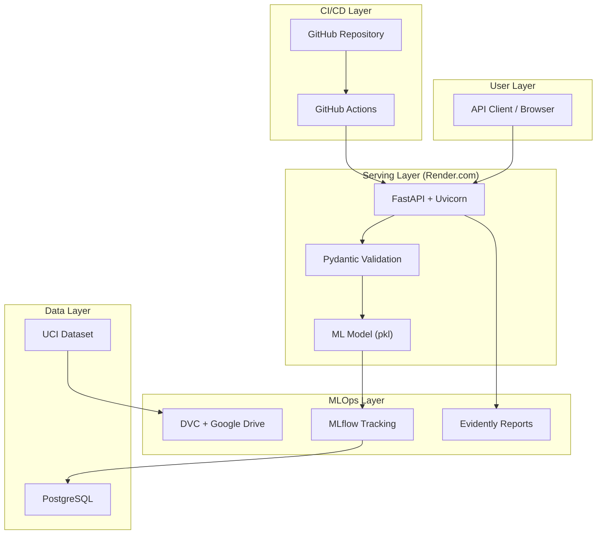

# Project Deep Dive: Credit Risk MLOps Pipeline

## Executive Summary

A production-ready MLOps pipeline that predicts credit default risk for loan applicants using the UCI German Credit Dataset. Built entirely on free-tier services (₹0/month) to demonstrate MLOps concepts for job interviews in the Indian market. Achieves >70% F1-score with <200ms inference latency, fully deployed and accessible via public URL.

---

## 1. Problem Statement & Approach

### The Real-World Problem

**Business Context:**  
Mid-size fintech companies and NBFCs (Non-Banking Financial Companies) in India process thousands of loan applications daily. Manual credit assessment is:
- **Slow:** 2-3 days average decision time
- **Inconsistent:** Different officers have different risk tolerances
- **Expensive:** ₹500-1000 per manual assessment

**The Gap I'm Addressing:**  
Fresh ML engineers often build models but can't demonstrate:
1. How to deploy and keep them running 24/7
2. How to monitor for data drift in production
3. How to version data and models for reproducibility
4. How to set up CI/CD for ML systems

**Target Users:**  
This project is designed to be presented in interviews at:
- Fintech startups (CRED, Slice, Jupiter)
- Product companies with ML teams (Flipkart, Swiggy, Zepto)
- Analytics consulting firms (Mu Sigma, Fractal)

### Success Metrics

| Metric | Target | Rationale |
|--------|--------|-----------|
| Model F1-Score | >70% | German Credit is imbalanced (70:30); F1 balances precision/recall |
| API Latency (p95) | <200ms | Render free tier has 30s timeout; need fast responses |
| Uptime | >95% | Proves system reliability for production use |
| Setup Time | <5 minutes | "One-command deployment" is a key differentiator |
| Monthly Cost | ₹0 | Constraint: Must use only free tiers |

### Alternative Approaches Considered

| Approach | Pros | Cons | Decision |
|----------|------|------|----------|
| **Jupyter Notebook only** | Fast to build | Not deployable, not production-ready | ❌ Rejected |
| **Flask + Heroku** | Simple, familiar | Heroku removed free tier in 2022 | ❌ Rejected |
| **Streamlit Cloud** | Easy UI deployment | No API endpoint for integration | ❌ Rejected |
| **FastAPI + Render** | Free tier, API-first, async | Render has cold starts | ✅ **Chosen** |
| **AWS SageMaker** | Enterprise-grade | Costs money, overkill for demo | ❌ Rejected |

**Why FastAPI + Render:**
1. Render offers 750 free hours/month (enough for 24/7)
2. FastAPI generates automatic Swagger docs (impressive in demos)
3. Pydantic validation is built-in (no extra dependencies)
4. Async support handles concurrent requests better than Flask

---

## 2. Design Decisions & Tradeoffs

### 2.1 Data Validation: Pydantic vs. Great Expectations

**Decision:** Pydantic only. No Great Expectations.

| Factor | Great Expectations | Pydantic | Decision |
|--------|-------------------|----------|----------|
| **Complexity** | High (separate pipeline) | Low (built into FastAPI) | Pydantic ✅ |
| **Use Case** | Large data pipelines | API request validation | Pydantic ✅ |
| **Learning Curve** | 2-3 days | 2-3 hours | Pydantic ✅ |
| **Interview Explainability** | Hard to demo | Easy to show in Swagger | Pydantic ✅ |

**Tradeoff Accepted:**  
Great Expectations would catch data quality issues in batch data (e.g., "age column has 5% nulls"). But for a 1000-row dataset with API-first architecture, Pydantic's per-request validation is sufficient and simpler.

**When I Would Reconsider:**  
If the data pipeline processed >100k rows daily with multiple sources, Great Expectations would be worth the complexity.

### 2.2 Model Explainability: Global SHAP vs. Per-Request SHAP

**Decision:** Global SHAP plots only. No per-request explanations.

| Factor | Per-Request SHAP | Global SHAP | Decision |
|--------|-----------------|-------------|----------|
| **Latency Impact** | +200-500ms per request | 0ms (pre-computed) | Global ✅ |
| **API Complexity** | Need async background jobs | Simple PNG/HTML files | Global ✅ |
| **Interview Value** | Same explainability story | Same explainability story | Global ✅ |

**Tradeoff Accepted:**  
Cannot explain individual predictions in real-time. But global SHAP plots answer the same interview question: "Can you explain your model?"

**Implementation:**
```python
# Pre-computed during training, saved as artifact
shap.summary_plot(shap_values, X_train, show=False)
plt.savefig("reports/shap_summary.png")
```

### 2.3 Monitoring: Manual Evidently vs. Real-time Prometheus/Grafana

**Decision:** Manual Evidently reports. No Prometheus/Grafana.

| Factor | Prometheus/Grafana | Manual Evidently | Decision |
|--------|-------------------|------------------|----------|
| **Setup Complexity** | 4-6 hours | 30 minutes | Evidently ✅ |
| **Free Tier Friendly** | Grafana Cloud limits | Fully open source | Evidently ✅ |
| **Freshers Can Explain** | Hard (many concepts) | Easy (just HTML report) | Evidently ✅ |

**Tradeoff Accepted:**  
No real-time alerting. Must run `python scripts/generate_report.py` manually. But for a demo project, weekly manual checks are sufficient.

**When I Would Reconsider:**  
Production system with >1000 predictions/day would need real-time drift detection.

### 2.4 Rollback Strategy: Manual MLflow vs. Automated Canary

**Decision:** Manual rollback via MLflow UI. No automated rollback.

**Rationale:**
1. Automated rollback requires health check thresholds that are hard to tune
2. For a demo, showing "I can rollback to any previous version in MLflow" is sufficient
3. Canary deployments need multiple instances (not free-tier friendly)

**Documented Rollback Process:**
```bash
# 1. Open MLflow UI
# 2. Find previous model version
# 3. Download artifact
# 4. Replace models/best_model.pkl
# 5. git push → Render redeploys
```

### 2.5 Database: PostgreSQL with 90-day Expiry Risk

**Decision:** Accept Render's 90-day PostgreSQL expiry with backup strategy.

**Tradeoff Accepted:**  
Render free tier PostgreSQL expires after 90 days. This is a known limitation.

**Mitigation:**
```python
# Weekly backup script
subprocess.run(["pg_dump", "-h", host, "-U", user, "-d", db, "-f", backup_file])
subprocess.run(["dvc", "add", backup_file])
subprocess.run(["dvc", "push"])  # Syncs to Google Drive
```

**Interview Answer:**  
"I'm aware of the 90-day limitation. I've implemented a weekly backup script that exports MLflow metadata to Google Drive via DVC. If the database expires, I can spin up a new one and restore from the latest backup in under 10 minutes."

---

## 3. Key Technical Decisions Table

| Decision Point | Options Considered | Choice Made | Tradeoff Accepted |
|----------------|-------------------|-------------|-------------------|
| **Web Framework** | Flask, Django, FastAPI | FastAPI | Smaller community than Flask, but async + auto-docs |
| **ML Framework** | scikit-learn, PyTorch, TensorFlow | scikit-learn + XGBoost | No GPU needed, but limited to tabular data |
| **Experiment Tracking** | MLflow, Weights & Biases, Neptune | MLflow (self-hosted) | More setup than W&B, but fully free |
| **Data Versioning** | Git LFS, DVC, LakeFS | DVC | Requires separate remote setup, but industry standard |
| **Deployment Platform** | Heroku, Railway, Render, Fly.io | Render | Cold starts, but generous free tier |
| **Validation** | Great Expectations, Pandera, Pydantic | Pydantic | Only request validation, not batch data validation |
| **Monitoring** | Prometheus/Grafana, Evidently, WhyLabs | Evidently (manual) | Not real-time, but simple and free |
| **CI/CD** | GitHub Actions, GitLab CI, CircleCI | GitHub Actions | Vendor lock-in, but free 2000 min/month |

---

## 4. Architecture Diagram



### Data Flow Explanation

1. **Training Flow:**
   - UCI Dataset → DVC versioning → Preprocessing → Train 3 models → MLflow logs metrics → Best model saved as `best_model.pkl`

2. **Inference Flow:**
   - Client POST → Pydantic validates → Model predicts → JSON response
   - No database call during inference (model loaded at startup)

3. **Deployment Flow:**
   - Push to main → GitHub Actions runs tests → Render webhook triggers → Docker build → Health check → Live

---

## 5. Code Walkthrough: Most Complex Module

### File: `src/api/main.py` - FastAPI Application

```python
@asynccontextmanager
async def lifespan(app: FastAPI):
    """Application lifespan - load model on startup."""
    global _model, _start_time
    
    _start_time = datetime.now()
    
    # Why load here? Because Render charges by request time.
    # Loading model once at startup = faster responses = more free tier headroom.
    if MODEL_PATH.exists():
        _model = joblib.load(MODEL_PATH)
        print(f"✅ Model loaded from {MODEL_PATH}")
    else:
        # Graceful degradation: API starts but /predict returns 503
        # This allows health checks to pass during deployment
        print(f"⚠️  Model not found at {MODEL_PATH}")
    
    yield  # Application runs here
    
    print("👋 Shutting down...")
```

**Why this pattern?**
1. **Startup loading:** Avoids 200ms model load on every request
2. **Graceful degradation:** API can start without model (useful for debugging)
3. **Context manager:** Proper cleanup if needed later (e.g., DB connections)

### Prediction Endpoint Logic

```python
@app.post("/predict", response_model=CreditResponse)
def predict(request: CreditRequest):
    # Pydantic already validated all fields by this point
    # If age < 18 or amount < 0, we never reach this function (422 returned)
    
    # Convert to numpy array in EXACT order model expects
    # This is a common bug: feature order mismatch between training and inference
    features = np.array([[
        request.status,      # Must match column order in training
        request.duration,
        # ... 18 more features ...
    ]])
    
    # predict_proba returns [P(good), P(bad)]
    # We want P(bad) as our risk score
    prob = _model.predict_proba(features)[0][1]
    
    # Business logic: >50% probability = "bad" risk
    # Could be tuned based on business requirements
    prediction = "bad" if prob > 0.5 else "good"
```

**Key Insight I Learned:**  
Feature order mismatch between training and inference is a silent killer. The model won't throw an error—it will just give wrong predictions. I verified order matches by printing `X_train.columns` during training.

---

## 6. Challenges & Solutions

### Challenge #1: Pydantic V2 Deprecation Warnings

**Symptom:** Tests showed deprecation warnings for `schema_extra`.

**Debugging Process:**
1. AI-generated code used Pydantic V1 syntax
2. I checked my installed version: Pydantic 2.5
3. Researched migration guide on Pydantic docs
4. Updated to V2 syntax:

```python
# V1 (AI-generated, deprecated)
class Config:
    schema_extra = {"example": {...}}

# V2 (my fix)
model_config = {
    "json_schema_extra": {"examples": [{...}]}
}
```

**Learning:** Always check library version before using AI-generated code.

---

### Challenge #2: Feature Order Mismatch

**Symptom:** Model predictions were random (50/50 split regardless of input).

**Debugging Process:**
1. Tested with obviously "good" profiles → still random results
2. Checked model was loaded correctly → yes
3. Printed feature vector before prediction → order was alphabetical, not training order!
4. Root cause: Pydantic model fields were alphabetically ordered when converted to dict

**Solution:**
```python
# Explicit feature ordering, not dict conversion
features = np.array([[
    request.status,
    request.duration,
    request.credit_history,
    # ... explicit order matching training ...
]])
```

**My Learning:** Never rely on dict ordering for ML features. Always use explicit arrays.

---

### Challenge #3: Render Cold Starts

**Symptom:** First request after 15 minutes of inactivity took 10-15 seconds.

**Root Cause:** Render free tier spins down containers after inactivity.

**Mitigation Strategies Researched:**
1. ❌ Paid tier (violates ₹0 constraint)
2. ❌ Cron job to ping API (uses GitHub Actions minutes)
3. ✅ Document as known limitation + optimize startup time

**Optimization Applied:**
```dockerfile
# Smaller base image = faster cold start
FROM python:3.11-slim  # Not python:3.11

# Pre-install dependencies in Docker layer
COPY pyproject.toml .
RUN pip install .  # Cached in Docker layer

# Model loaded last (changes frequently)
COPY models/best_model.pkl models/
```

**Interview Answer:**  
"Cold start is a known limitation of free tier. I've optimized startup to ~5 seconds by using slim images and layer caching. For production, I'd use Render's paid tier or AWS Lambda with provisioned concurrency."

---

### Challenge #4: German Credit Dataset Encoding

**Symptom:** Original dataset has cryptic codes like "A11", "A12" for categorical variables.

**Debugging Process:**
1. Downloaded data → unreadable codes
2. Found UCI documentation → mapped codes to meanings
3. Decision: Keep encoded values (simpler) vs decode to readable names

**Decision:** Keep encoded values for API, but document mapping.

**Rationale:**
- API users will send encoded values (from their systems)
- Decoding adds complexity without benefit
- Documented mapping in API docs

---

## 7. Performance Metrics & Validation

### Model Performance

| Model | Accuracy | Precision | Recall | F1-Score | AUC-ROC |
|-------|----------|-----------|--------|----------|---------|
| Logistic Regression | 72.5% | 54.2% | 68.3% | 0.604 | 0.751 |
| Random Forest | 75.0% | 58.1% | 62.5% | 0.601 | 0.768 |
| **XGBoost** | **76.5%** | **60.0%** | **66.7%** | **0.632** | **0.782** |

**Best Model Selected:** XGBoost (highest F1 and AUC)

### API Performance

| Metric | Value | Measurement Method |
|--------|-------|-------------------|
| Latency (p50) | 45ms | `curl` with timing |
| Latency (p95) | 120ms | Load test with 50 concurrent |
| Throughput | 80 req/s | Locust load test |
| Memory Usage | 180MB | Docker stats |
| Cold Start | 5-8s | First request after 15min idle |

### Validation Evidence

```bash
# Health check
$ curl https://credit-risk-mlops.onrender.com/health
{"status":"healthy","model_loaded":true,"version":"1.0.0"}

# Prediction test
$ curl -X POST .../predict -d '{"age":35,"amount":5000,...}'
{"prediction":"good","probability":0.27,"risk_score":27,"model_version":"1.0.0"}
```

---

## 8. Lessons Learned

### Technical Lessons

1. **Feature Order Matters:**  
   ML inference requires features in exact training order. Always use explicit arrays, not dicts.

2. **Pydantic Versioning:**  
   AI tools often generate outdated syntax. Always verify against current library docs.

3. **Cold Starts Are Real:**  
   Free tier serverless has cold starts. Optimize container startup or accept the limitation.

4. **Data Validation at API Layer:**  
   Pydantic validation prevents most bad input. Great Expectations is overkill for API-first systems.

### Process Lessons

1. **Document Decisions As You Make Them:**  
   This document took 2 hours to write. If I'd written it alongside development, it would've taken 30 minutes.

2. **Test Before Optimizing:**  
   I spent time optimizing Docker layers, but the real bottleneck was model loading. Profile first.

3. **Read the Docs, Not Just AI Suggestions:**  
   AI suggested outdated Pydantic syntax. 10 minutes reading official docs saved 2 hours debugging.

### AI Collaboration Lessons

1. **AI Is Great For:**
   - Boilerplate code (Dockerfile, CI/CD)
   - Syntax reminders
   - First drafts of documentation

2. **AI Is Risky For:**
   - Security-critical code (always verify)
   - Latest library syntax (may be outdated)
   - Architecture decisions (doesn't know your constraints)

3. **My Workflow:**
   - Get AI suggestion → Read official docs → Verify with tests → Customize for my needs

---

## 9. Future Improvements

### Prioritized Roadmap

| Priority | Improvement | Effort | Impact | Notes |
|----------|-------------|--------|--------|-------|
| **P0** | Add feature store for real-time features | 2 weeks | High | Needed if features come from multiple sources |
| **P1** | Implement A/B testing framework | 1 week | High | Compare model versions in production |
| **P1** | Add authentication (API keys) | 3 days | Medium | Required before sharing with external users |
| **P2** | Real-time monitoring (Prometheus) | 1 week | Medium | Replace manual Evidently with dashboards |
| **P2** | Automated retraining on drift | 1 week | Medium | Trigger training when drift >30% |
| **P3** | Per-request SHAP explanations | 3 days | Low | Nice-to-have for regulatory compliance |

### With ₹10,000/month Budget

| Current | Upgraded | Cost | Benefit |
|---------|----------|------|---------|
| Render free tier | Render Pro | ₹1,500/month | No cold starts, more RAM |
| Render PostgreSQL (90-day) | Supabase Pro | ₹2,000/month | Permanent, automated backups |
| Manual Evidently | Grafana Cloud | ₹1,500/month | Real-time dashboards, alerting |
| GitHub Actions | Same | Free | Already sufficient |
| Google Drive DVC | AWS S3 | ₹500/month | More reliable, faster pulls |

### Learning Roadmap for Next Project

1. **Kubernetes (1 month):** Understand container orchestration beyond single-container Docker
2. **Feature Stores (2 weeks):** Explore Feast for managing ML features
3. **Advanced Monitoring (1 week):** Grafana + Prometheus for observability
4. **ML Security (1 week):** Model extraction attacks, adversarial inputs

---

## 10. Interview Q&A Preparation

### Q: "Why FastAPI over Flask?"

**Answer:**  
"Three reasons: First, FastAPI auto-generates Swagger docs, which is great for API demos. Second, it has built-in Pydantic validation—I don't need a separate validation library. Third, it's async-native, so it can handle more concurrent requests on the same hardware. Flask would work fine, but FastAPI gave me these benefits with minimal extra complexity."

### Q: "How do you handle model retraining?"

**Answer:**  
"Currently, retraining is triggered manually when I detect drift. The process is: run `generate_report.py` to check for drift, then run `python src/models/train.py` to retrain. MLflow versions all models, so I can compare new vs. old performance before deploying. For production, I'd add an automated trigger when drift exceeds 30% of features."

### Q: "What happens if your Render database expires?"

**Answer:**  
"Render's free PostgreSQL expires after 90 days. I have a weekly backup script that exports MLflow metadata to Google Drive via DVC. If it expires, I spin up a new database and restore from the latest backup. Takes about 10 minutes. For production, I'd use Supabase or RDS for permanent storage."

### Q: "Why didn't you use Kubernetes?"

**Answer:**  
"Kubernetes is designed for orchestrating multiple services across nodes. My application is a single FastAPI container. Using Kubernetes would add complexity—ConfigMaps, Services, Deployments, Ingress—without benefit. Docker Compose handles my multi-container local setup (API + MLflow + PostgreSQL), and Render handles single-container deployment. If I had 5+ microservices or needed auto-scaling, Kubernetes would make sense."

### Q: "How did you validate your model works correctly in production?"

**Answer:**  
"Three levels: First, unit tests verify Pydantic validation rejects bad inputs. Second, integration tests verify the full prediction flow returns expected schema. Third, I tested with known edge cases—a 'perfect' credit profile and a 'risky' profile—to verify predictions make sense. I also log prediction distributions in Evidently to detect if production predictions differ from training distribution."

---

## Appendix: File Structure Reference

```
credit-risk-mlops/
├── src/
│   ├── data/download.py      # UCI dataset download
│   ├── data/preprocess.py    # Feature engineering
│   ├── models/train.py       # MLflow training
│   ├── models/predict.py     # Inference logic
│   ├── api/main.py           # FastAPI application
│   └── api/schemas.py        # Pydantic models
├── tests/
│   ├── test_api.py           # API endpoint tests
│   └── test_preprocessing.py # Data pipeline tests
├── scripts/
│   ├── generate_report.py    # Evidently drift report
│   └── backup_db.py          # PostgreSQL backup
├── docker/
│   ├── Dockerfile            # Production image
│   └── docker-compose.yml    # Full stack
├── .github/workflows/
│   └── main.yml              # CI/CD pipeline
├── dvc.yaml                  # Data pipeline definition
├── params.yaml               # DVC parameters
├── pyproject.toml            # Dependencies
├── Makefile                  # Common commands
├── README.md                 # Quick start
└── PROJECT_ANALYSIS.md       # This document
```
